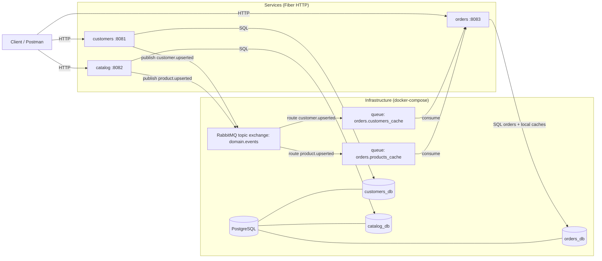

# E-Commerce Microservices (Go)

## Architecture

Notes:
- `customers` and `catalog` publish domain events on RabbitMQ.
- `orders` consumes those events to keep local cache tables up to date for `/orders/:id/view`.

## Services
- `customers`: `http://localhost:8081`
- `catalog`: `http://localhost:8082`
- `orders`: `http://localhost:8083`

## Run
- `docker compose up --build`
- Optional UIs: RabbitMQ management `http://localhost:15672` (guest/guest)
